# Story state machines

_Auto-generated by `scripts/stories-machines.ts` (`npm run story:machines`). 62 machines across 7 surfaces. Diagrams render inline on GitHub / VS Code._

| Surface | Machines |
| --- | --- |
| [admin](#admin) | 5 |
| [creator-hub](#creator-hub) | 11 |
| [governance](#governance) | 19 |
| [landings](#landings) | 8 |
| [marketplace](#marketplace) | 10 |
| [misc](#misc) | 1 |
| [overlay](#overlay) | 8 |

## admin

### admin/communities-moderation
`moderateMachine` - 6 states - [source](./admin/communities-moderation/machine.ts)

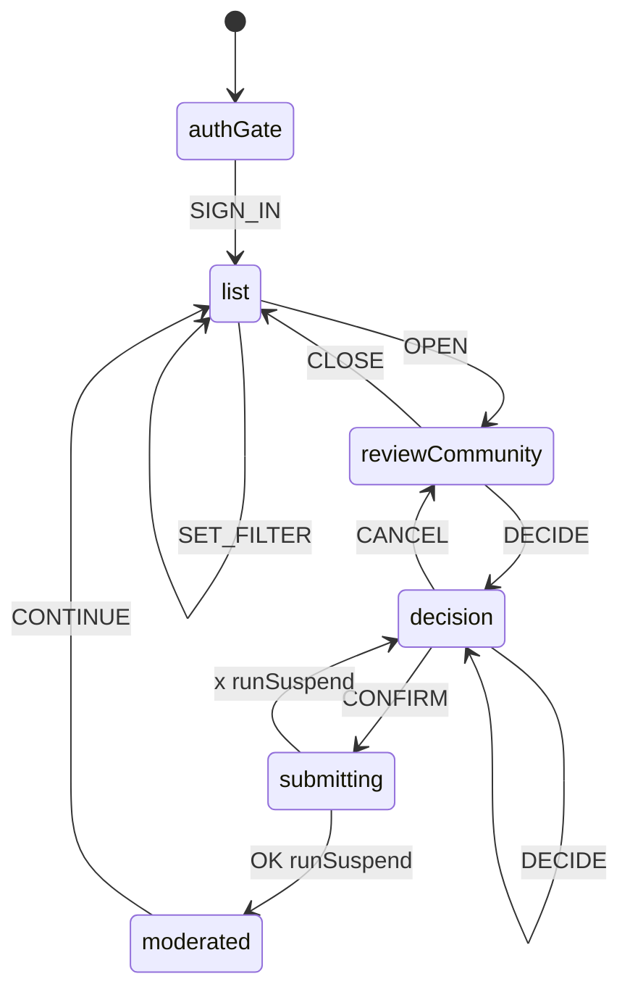
```mermaid
stateDiagram-v2
  [*] --> authGate
  authGate
  list
  reviewCommunity
  decision
  submitting
  moderated
  authGate --> list : SIGN_IN
  list --> list : SET_FILTER
  list --> reviewCommunity : OPEN
  reviewCommunity --> decision : DECIDE
  reviewCommunity --> list : CLOSE
  decision --> submitting : CONFIRM
  decision --> decision : DECIDE
  decision --> reviewCommunity : CANCEL
  submitting --> moderated : OK runSuspend
  submitting --> decision : x runSuspend
  moderated --> list : CONTINUE
```

### admin/operator-scene-admins
`manageMachine` - 6 states - [source](./admin/operator-scene-admins/machine.ts)

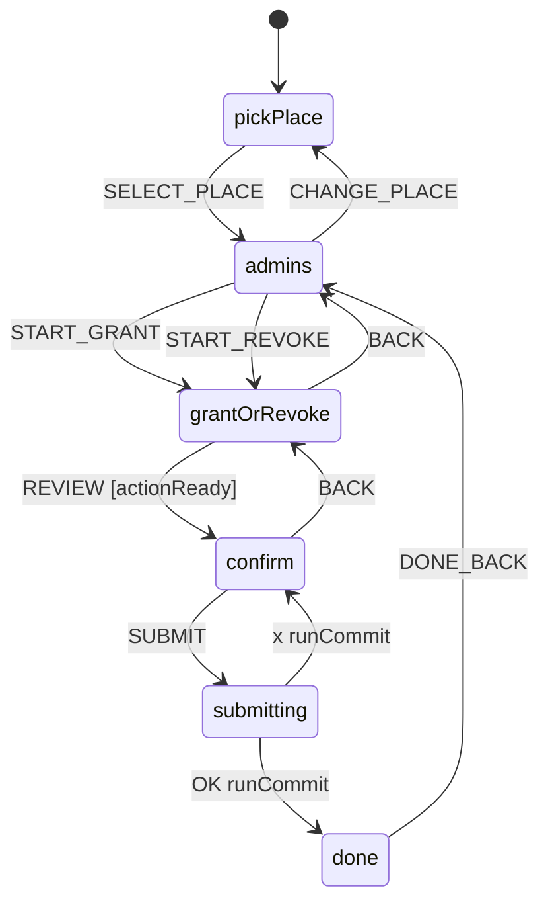
```mermaid
stateDiagram-v2
  [*] --> pickPlace
  pickPlace
  admins
  grantOrRevoke
  confirm
  submitting
  done
  pickPlace --> admins : SELECT_PLACE
  admins --> grantOrRevoke : START_GRANT
  admins --> grantOrRevoke : START_REVOKE
  admins --> pickPlace : CHANGE_PLACE
  grantOrRevoke --> confirm : REVIEW [actionReady]
  grantOrRevoke --> admins : BACK
  confirm --> submitting : SUBMIT
  confirm --> grantOrRevoke : BACK
  submitting --> done : OK runCommit
  submitting --> confirm : x runCommit
  done --> admins : DONE_BACK
```

### admin/operator-scene-bans
`sceneBanMachine` - 6 states - [source](./admin/operator-scene-bans/machine.ts)

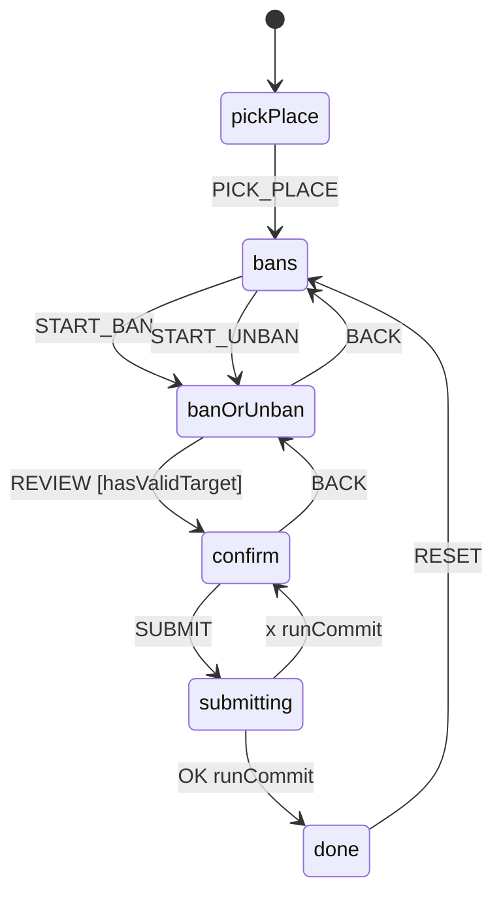
```mermaid
stateDiagram-v2
  [*] --> pickPlace
  pickPlace
  bans
  banOrUnban
  confirm
  submitting
  done
  pickPlace --> bans : PICK_PLACE
  bans --> banOrUnban : START_BAN
  bans --> banOrUnban : START_UNBAN
  banOrUnban --> confirm : REVIEW [hasValidTarget]
  banOrUnban --> bans : BACK
  confirm --> submitting : SUBMIT
  confirm --> banOrUnban : BACK
  submitting --> done : OK runCommit
  submitting --> confirm : x runCommit
  done --> bans : RESET
```

### admin/operator-user-bans
`userBanMachine` - 6 states - [source](./admin/operator-user-bans/machine.ts)

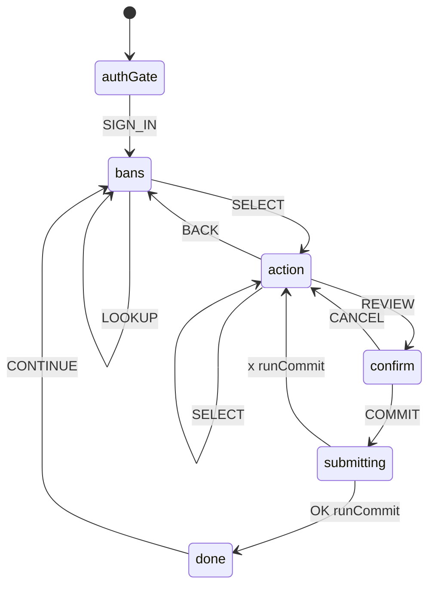
```mermaid
stateDiagram-v2
  [*] --> authGate
  authGate
  bans
  action
  confirm
  submitting
  done
  authGate --> bans : SIGN_IN
  bans --> bans : LOOKUP
  bans --> action : SELECT
  action --> action : SELECT
  action --> confirm : REVIEW
  action --> bans : BACK
  confirm --> submitting : COMMIT
  confirm --> action : CANCEL
  submitting --> done : OK runCommit
  submitting --> action : x runCommit
  done --> bans : CONTINUE
```

### admin/places-moderation
`moderateMachine` - 5 states - [source](./admin/places-moderation/machine.ts)

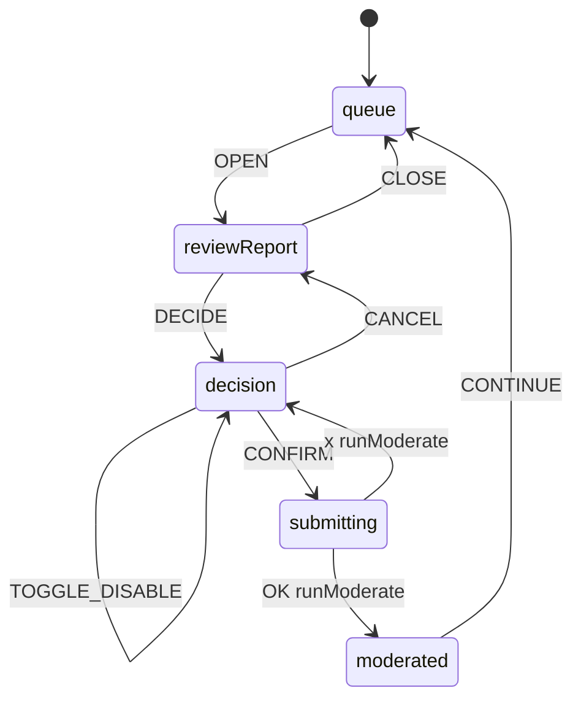
```mermaid
stateDiagram-v2
  [*] --> queue
  queue
  reviewReport
  decision
  submitting
  moderated
  queue --> reviewReport : OPEN
  reviewReport --> decision : DECIDE
  reviewReport --> queue : CLOSE
  decision --> decision : DECIDE
  decision --> decision : TOGGLE_DISABLE
  decision --> submitting : CONFIRM
  decision --> reviewReport : CANCEL
  submitting --> moderated : OK runModerate
  submitting --> decision : x runModerate
  moderated --> queue : CONTINUE
```

## creator-hub

### creator-hub/claim-name
`claimNameMachine` - 8 states - [source](./creator-hub/claim-name/machine.ts)

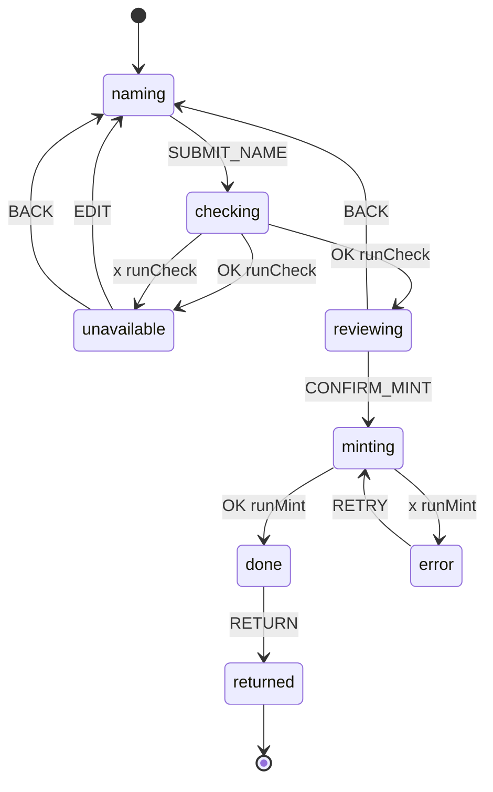
```mermaid
stateDiagram-v2
  [*] --> naming
  naming
  checking
  unavailable
  reviewing
  minting
  done
  returned
  error
  naming --> checking : SUBMIT_NAME
  checking --> reviewing : OK runCheck
  checking --> unavailable : OK runCheck
  checking --> unavailable : x runCheck
  unavailable --> naming : EDIT
  unavailable --> naming : BACK
  reviewing --> minting : CONFIRM_MINT
  reviewing --> naming : BACK
  minting --> done : OK runMint
  minting --> error : x runMint
  done --> returned : RETURN
  error --> minting : RETRY
  returned --> [*]
```

### creator-hub/create-project
`createProjectMachine` - 5 states - [source](./creator-hub/create-project/machine.ts)

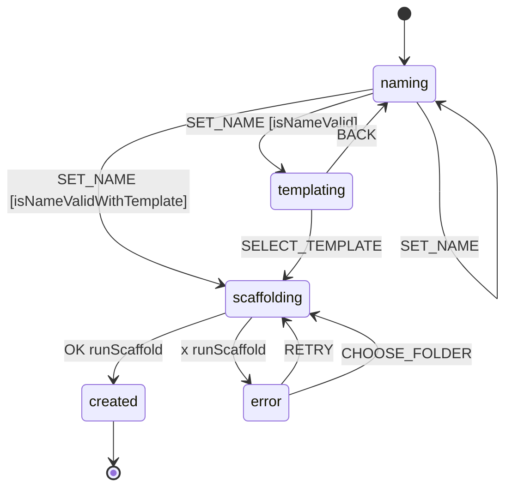
```mermaid
stateDiagram-v2
  [*] --> naming
  naming
  templating
  scaffolding
  created
  error
  naming --> scaffolding : SET_NAME [isNameValidWithTemplate]
  naming --> templating : SET_NAME [isNameValid]
  naming --> naming : SET_NAME
  templating --> scaffolding : SELECT_TEMPLATE
  templating --> naming : BACK
  scaffolding --> created : OK runScaffold
  scaffolding --> error : x runScaffold
  error --> scaffolding : RETRY
  error --> scaffolding : CHOOSE_FOLDER
  created --> [*]
```

### creator-hub/curate-committee
`curationMachine` - 6 states - [source](./creator-hub/curate-committee/machine.ts)

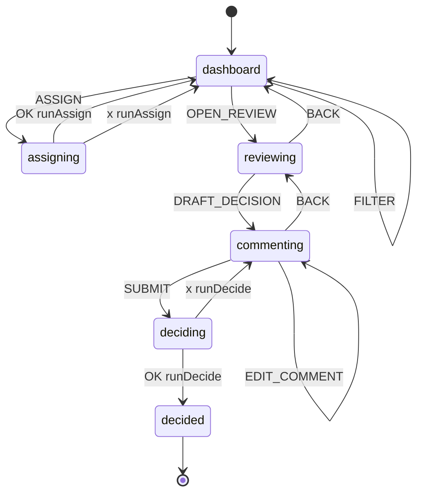
```mermaid
stateDiagram-v2
  [*] --> dashboard
  dashboard
  assigning
  reviewing
  commenting
  deciding
  decided
  dashboard --> dashboard : FILTER
  dashboard --> assigning : ASSIGN
  dashboard --> reviewing : OPEN_REVIEW
  assigning --> dashboard : OK runAssign
  assigning --> dashboard : x runAssign
  reviewing --> commenting : DRAFT_DECISION
  reviewing --> dashboard : BACK
  commenting --> commenting : EDIT_COMMENT
  commenting --> deciding : SUBMIT
  commenting --> reviewing : BACK
  deciding --> decided : OK runDecide
  deciding --> commenting : x runDecide
  decided --> [*]
```

### creator-hub/deploy-scene
`deployWorldMachine` - 9 states - [source](./creator-hub/deploy-scene/machine.ts)

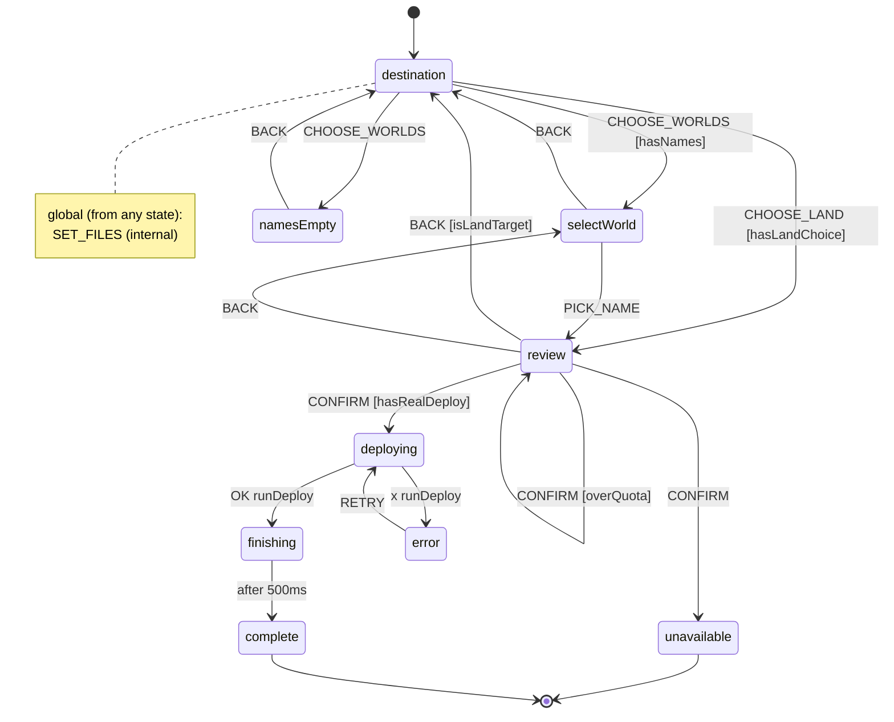
```mermaid
stateDiagram-v2
  [*] --> destination
  destination
  selectWorld
  namesEmpty
  review
  unavailable
  deploying
  finishing
  complete
  error
  destination --> selectWorld : CHOOSE_WORLDS [hasNames]
  destination --> namesEmpty : CHOOSE_WORLDS
  destination --> review : CHOOSE_LAND [hasLandChoice]
  selectWorld --> review : PICK_NAME
  selectWorld --> destination : BACK
  namesEmpty --> destination : BACK
  review --> review : CONFIRM [overQuota]
  review --> deploying : CONFIRM [hasRealDeploy]
  review --> unavailable : CONFIRM
  review --> destination : BACK [isLandTarget]
  review --> selectWorld : BACK
  deploying --> finishing : OK runDeploy
  deploying --> error : x runDeploy
  finishing --> complete : after 500ms
  error --> deploying : RETRY
  unavailable --> [*]
  complete --> [*]
  note right of destination
    global (from any state):
    SET_FILES (internal)
  end note
```

### creator-hub/multiplayer-test
`mpPanelMachine` - 10 states - [source](./creator-hub/multiplayer-test/machine.ts)

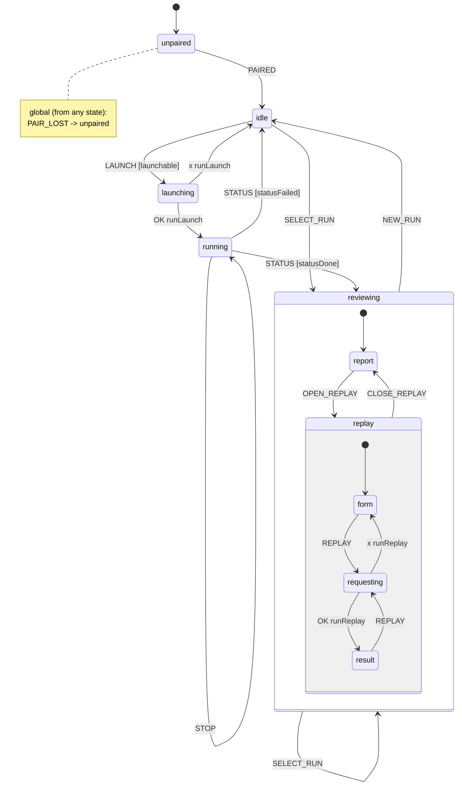
```mermaid
stateDiagram-v2
  [*] --> unpaired
  unpaired
  idle
  launching
  running
  state reviewing {
    [*] --> report
    report
    state replay {
      [*] --> form
      form
      requesting
      result
    }
  }
  unpaired --> idle : PAIRED
  idle --> launching : LAUNCH [launchable]
  idle --> reviewing : SELECT_RUN
  launching --> running : OK runLaunch
  launching --> idle : x runLaunch
  running --> reviewing : STATUS [statusDone]
  running --> idle : STATUS [statusFailed]
  running --> running : STATUS
  running --> running : STOP
  reviewing --> idle : NEW_RUN
  reviewing --> reviewing : SELECT_RUN
  report --> replay : OPEN_REPLAY
  replay --> report : CLOSE_REPLAY
  form --> requesting : REPLAY
  requesting --> result : OK runReplay
  requesting --> form : x runReplay
  result --> requesting : REPLAY
  note right of unpaired
    global (from any state):
    PAIR_LOST -> unpaired
  end note
```

### creator-hub/scene-editor-place-items
`editorMachine` - 9 states - [source](./creator-hub/scene-editor-place-items/machine.ts)

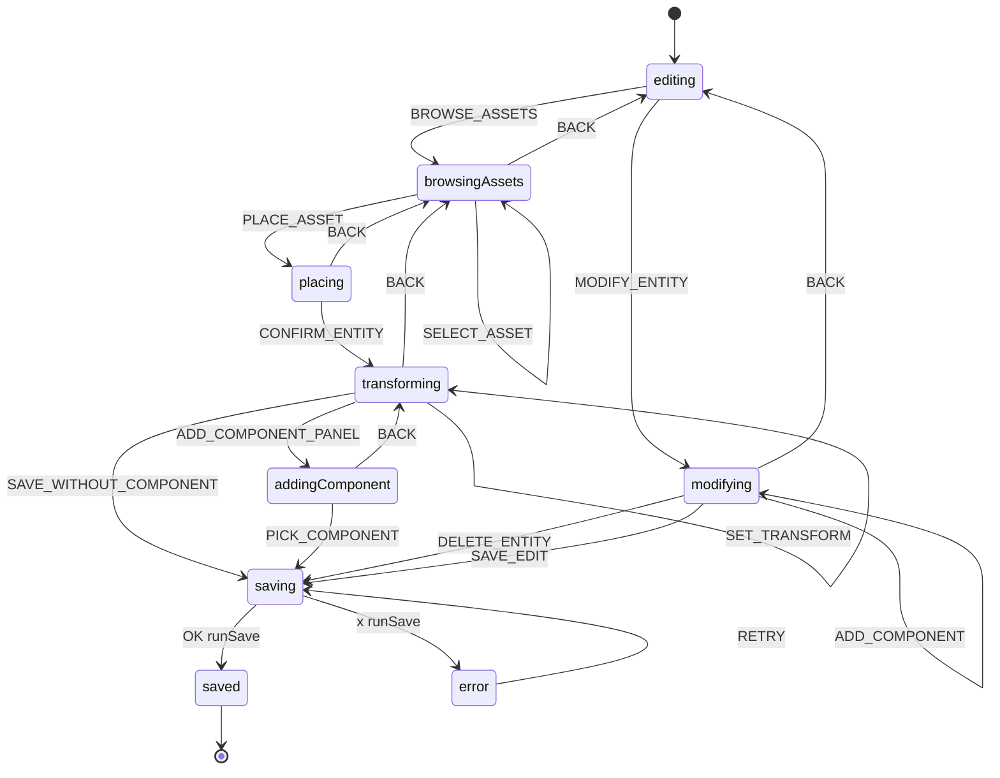
```mermaid
stateDiagram-v2
  [*] --> editing
  editing
  browsingAssets
  placing
  transforming
  addingComponent
  modifying
  saving
  saved
  error
  editing --> browsingAssets : BROWSE_ASSETS
  editing --> modifying : MODIFY_ENTITY
  browsingAssets --> browsingAssets : SEARCH
  browsingAssets --> browsingAssets : SELECT_ASSET
  browsingAssets --> placing : PLACE_ASSET
  browsingAssets --> editing : BACK
  placing --> transforming : CONFIRM_ENTITY
  placing --> browsingAssets : BACK
  transforming --> transforming : SET_TRANSFORM
  transforming --> addingComponent : ADD_COMPONENT_PANEL
  transforming --> saving : SAVE_WITHOUT_COMPONENT
  transforming --> browsingAssets : BACK
  addingComponent --> saving : PICK_COMPONENT
  addingComponent --> transforming : BACK
  modifying --> modifying : RENAME_ENTITY
  modifying --> modifying : SET_TRANSFORM
  modifying --> modifying : ADD_COMPONENT
  modifying --> saving : DELETE_ENTITY
  modifying --> saving : SAVE_EDIT
  modifying --> editing : BACK
  saving --> saved : OK runSave
  saving --> error : x runSave
  error --> saving : RETRY
  saved --> [*]
```

### creator-hub/wearable-create-collection
`createCollectionMachine` - 6 states - [source](./creator-hub/wearable-create-collection/machine.ts)

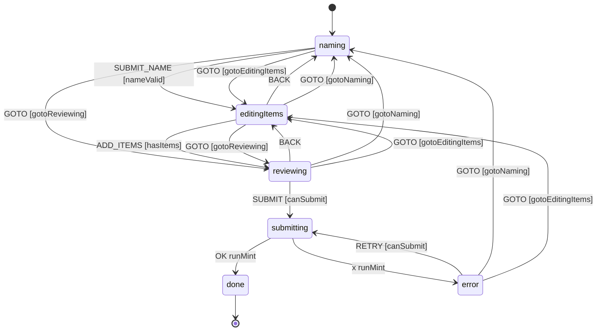
```mermaid
stateDiagram-v2
  [*] --> naming
  naming
  editingItems
  reviewing
  submitting
  done
  error
  naming --> editingItems : SUBMIT_NAME [nameValid]
  naming --> editingItems : GOTO [gotoEditingItems]
  naming --> reviewing : GOTO [gotoReviewing]
  editingItems --> reviewing : ADD_ITEMS [hasItems]
  editingItems --> naming : BACK
  editingItems --> naming : GOTO [gotoNaming]
  editingItems --> reviewing : GOTO [gotoReviewing]
  reviewing --> submitting : SUBMIT [canSubmit]
  reviewing --> editingItems : BACK
  reviewing --> naming : GOTO [gotoNaming]
  reviewing --> editingItems : GOTO [gotoEditingItems]
  submitting --> done : OK runMint
  submitting --> error : x runMint
  error --> submitting : RETRY [canSubmit]
  error --> naming : GOTO [gotoNaming]
  error --> editingItems : GOTO [gotoEditingItems]
  done --> [*]
```

### creator-hub/wearable-item-editor
`wearableEditorMachine` - 8 states - [source](./creator-hub/wearable-item-editor/machine.ts)

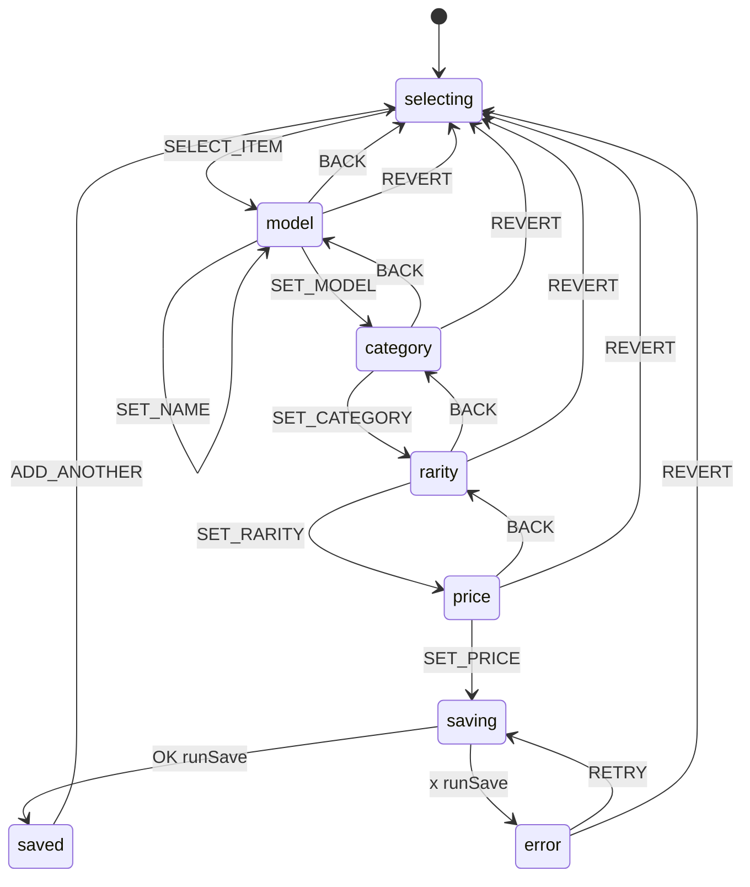
```mermaid
stateDiagram-v2
  [*] --> selecting
  selecting
  model
  category
  rarity
  price
  saving
  saved
  error
  selecting --> model : SELECT_ITEM
  model --> model : SET_NAME
  model --> category : SET_MODEL
  model --> selecting : BACK
  model --> selecting : REVERT
  category --> rarity : SET_CATEGORY
  category --> model : BACK
  category --> selecting : REVERT
  rarity --> price : SET_RARITY
  rarity --> category : BACK
  rarity --> selecting : REVERT
  price --> saving : SET_PRICE
  price --> rarity : BACK
  price --> selecting : REVERT
  saving --> saved : OK runSave
  saving --> error : x runSave
  saved --> selecting : ADD_ANOTHER
  error --> saving : RETRY
  error --> selecting : REVERT
```

### creator-hub/wearable-publish-collection
`publishMachine` - 8 states - [source](./creator-hub/wearable-publish-collection/machine.ts)

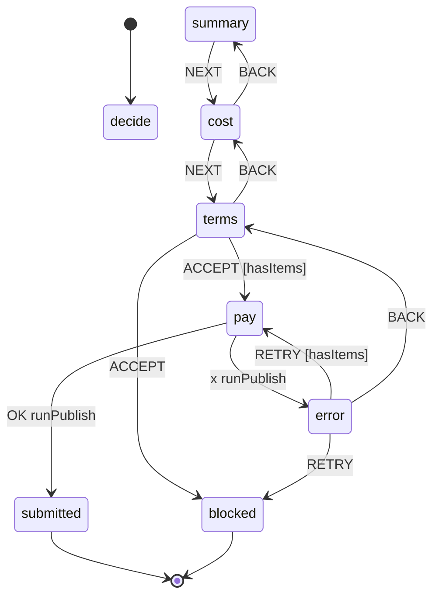
```mermaid
stateDiagram-v2
  [*] --> decide
  decide
  summary
  cost
  terms
  pay
  submitted
  error
  blocked
  summary --> cost : NEXT
  cost --> terms : NEXT
  cost --> summary : BACK
  terms --> pay : ACCEPT [hasItems]
  terms --> blocked : ACCEPT
  terms --> cost : BACK
  pay --> submitted : OK runPublish
  pay --> error : x runPublish
  error --> pay : RETRY [hasItems]
  error --> blocked : RETRY
  error --> terms : BACK
  submitted --> [*]
  blocked --> [*]
```

### creator-hub/world-permissions
`permissionsMachine` - 9 states - [source](./creator-hub/world-permissions/machine.ts)

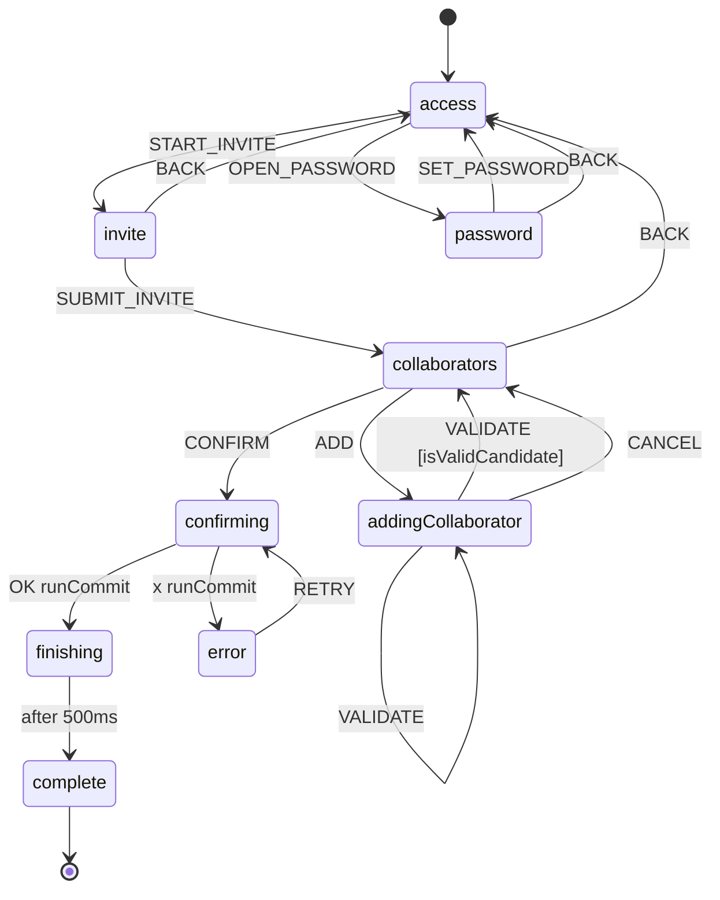
```mermaid
stateDiagram-v2
  [*] --> access
  access
  invite
  password
  collaborators
  addingCollaborator
  confirming
  finishing
  complete
  error
  access --> invite : START_INVITE
  access --> password : OPEN_PASSWORD
  invite --> collaborators : SUBMIT_INVITE
  invite --> access : BACK
  password --> access : SET_PASSWORD
  password --> access : BACK
  collaborators --> addingCollaborator : ADD
  collaborators --> confirming : CONFIRM
  collaborators --> access : BACK
  addingCollaborator --> collaborators : VALIDATE [isValidCandidate]
  addingCollaborator --> addingCollaborator : VALIDATE
  addingCollaborator --> collaborators : CANCEL
  confirming --> finishing : OK runCommit
  confirming --> error : x runCommit
  finishing --> complete : after 500ms
  error --> confirming : RETRY
  complete --> [*]
```

### creator-hub/world-settings
`worldSettingsMachine` - 7 states - [source](./creator-hub/world-settings/machine.ts)

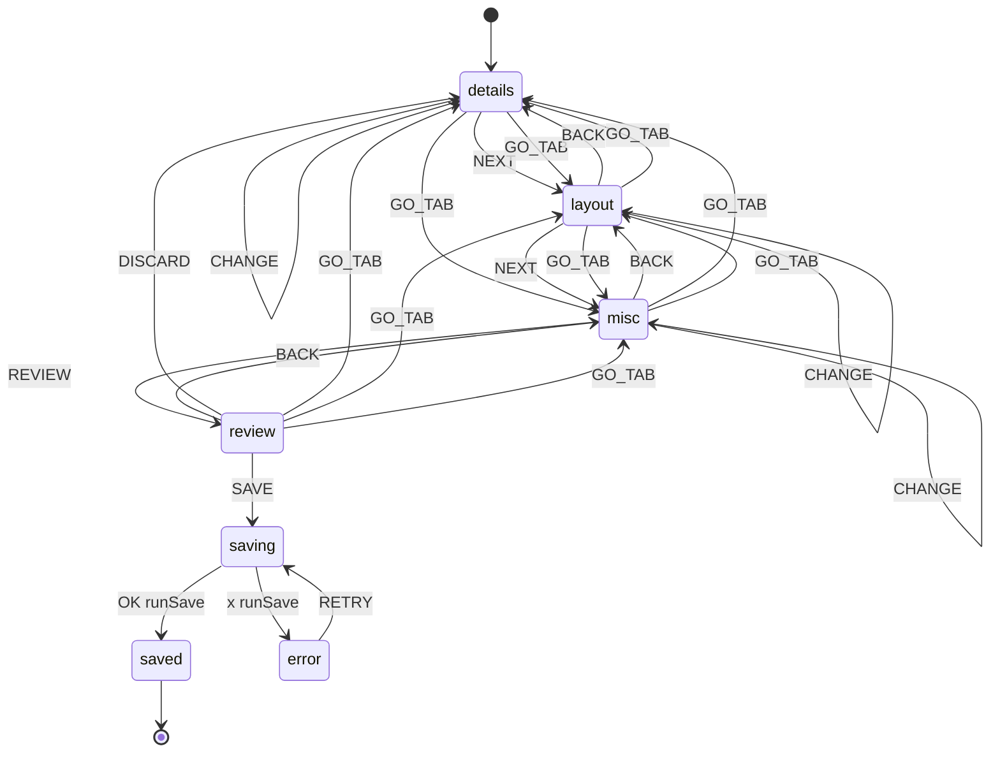
```mermaid
stateDiagram-v2
  [*] --> details
  details
  layout
  misc
  review
  saving
  saved
  error
  details --> details : CHANGE
  details --> layout : NEXT
  details --> layout : GO_TAB
  details --> misc : GO_TAB
  layout --> layout : CHANGE
  layout --> misc : NEXT
  layout --> details : BACK
  layout --> details : GO_TAB
  layout --> misc : GO_TAB
  misc --> misc : CHANGE
  misc --> review : REVIEW
  misc --> layout : BACK
  misc --> details : GO_TAB
  misc --> layout : GO_TAB
  review --> saving : SAVE
  review --> misc : BACK
  review --> details : DISCARD
  review --> details : GO_TAB
  review --> layout : GO_TAB
  review --> misc : GO_TAB
  saving --> saved : OK runSave
  saving --> error : x runSave
  error --> saving : RETRY
  saved --> [*]
```

## governance

### governance/delegate-vp
`delegateMachine` - 6 states - [source](./governance/delegate-vp/machine.ts)

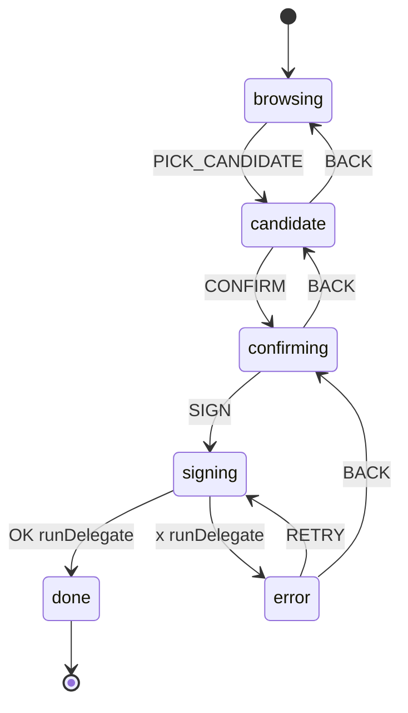
```mermaid
stateDiagram-v2
  [*] --> browsing
  browsing
  candidate
  confirming
  signing
  done
  error
  browsing --> candidate : PICK_CANDIDATE
  candidate --> confirming : CONFIRM
  candidate --> browsing : BACK
  confirming --> signing : SIGN
  confirming --> candidate : BACK
  signing --> done : OK runDelegate
  signing --> error : x runDelegate
  error --> signing : RETRY
  error --> confirming : BACK
  done --> [*]
```

### governance/edit-project-update
`editUpdateMachine` - 6 states - [source](./governance/edit-project-update/machine.ts)

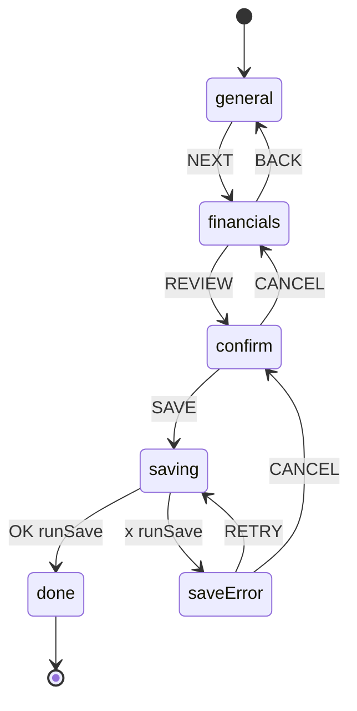
```mermaid
stateDiagram-v2
  [*] --> general
  general
  financials
  confirm
  saving
  saveError
  done
  general --> financials : NEXT
  financials --> confirm : REVIEW
  financials --> general : BACK
  confirm --> saving : SAVE
  confirm --> financials : CANCEL
  saving --> done : OK runSave
  saving --> saveError : x runSave
  saveError --> saving : RETRY
  saveError --> confirm : CANCEL
  done --> [*]
```

### governance/link-accounts
`linkAccountsMachine` - 7 states - [source](./governance/link-accounts/machine.ts)

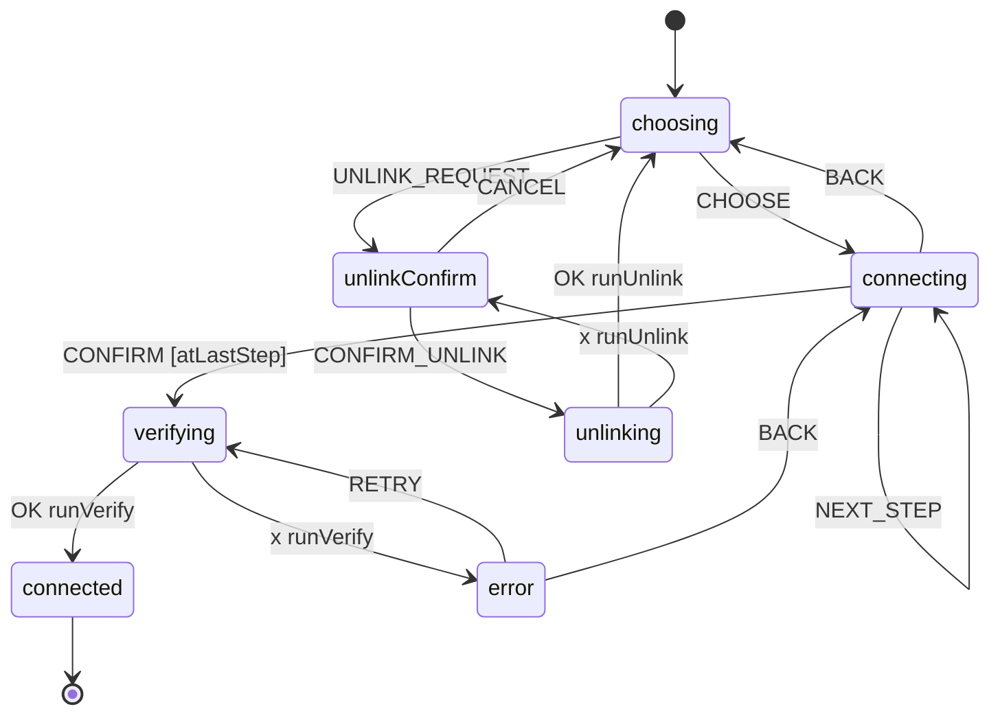
```mermaid
stateDiagram-v2
  [*] --> choosing
  choosing
  connecting
  verifying
  connected
  error
  unlinkConfirm
  unlinking
  choosing --> connecting : CHOOSE
  choosing --> unlinkConfirm : UNLINK_REQUEST
  connecting --> connecting : NEXT_STEP
  connecting --> verifying : CONFIRM [atLastStep]
  connecting --> choosing : BACK
  verifying --> connected : OK runVerify
  verifying --> error : x runVerify
  error --> verifying : RETRY
  error --> connecting : BACK
  unlinkConfirm --> unlinking : CONFIRM_UNLINK
  unlinkConfirm --> choosing : CANCEL
  unlinking --> choosing : OK runUnlink
  unlinking --> unlinkConfirm : x runUnlink
  connected --> [*]
```

### governance/submit-ban-name
`banNameMachine` - 6 states - [source](./governance/submit-ban-name/machine.ts)

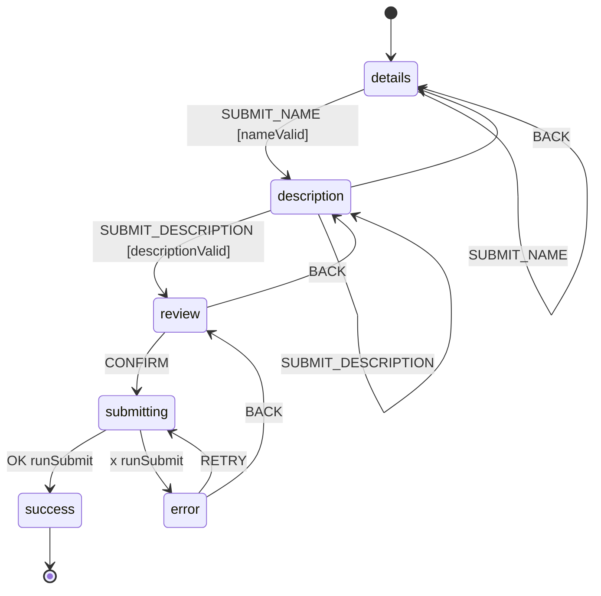
```mermaid
stateDiagram-v2
  [*] --> details
  details
  description
  review
  submitting
  success
  error
  details --> description : SUBMIT_NAME [nameValid]
  details --> details : SUBMIT_NAME
  description --> review : SUBMIT_DESCRIPTION [descriptionValid]
  description --> description : SUBMIT_DESCRIPTION
  description --> details : BACK
  review --> submitting : CONFIRM
  review --> description : BACK
  submitting --> success : OK runSubmit
  submitting --> error : x runSubmit
  error --> submitting : RETRY
  error --> review : BACK
  success --> [*]
```

### governance/submit-bid
`bidMachine` - 7 states - [source](./governance/submit-bid/machine.ts)

```mermaid
stateDiagram-v2
  [*] --> parents
  parents
  funding
  general
  review
  submitting
  submitError
  success
  parents --> funding : CONTINUE
  funding --> general : SET_FUNDING
  funding --> parents : BACK
  general --> review : NEXT
  general --> funding : BACK
  review --> submitting : SUBMIT
  review --> general : BACK
  submitting --> success : OK runSubmit
  submitting --> submitError : x runSubmit
  submitError --> submitting : RETRY
  submitError --> review : BACK
  success --> [*]
```

### governance/submit-catalyst
`submitCatalystMachine` - 6 states - [source](./governance/submit-catalyst/machine.ts)

```mermaid
stateDiagram-v2
  [*] --> details
  details
  description
  review
  submitting
  success
  error
  details --> description : FILL_DETAILS
  details --> details : DOMAIN_INVALID
  description --> review : FILL_DESCRIPTION
  description --> details : BACK
  review --> submitting : SUBMIT
  review --> description : BACK
  submitting --> success : OK runCreate
  submitting --> error : x runCreate
  error --> submitting : RETRY
  error --> review : BACK
  success --> [*]
```

### governance/submit-council-veto
`submitCouncilVetoMachine` - 7 states - [source](./governance/submit-council-veto/machine.ts)

```mermaid
stateDiagram-v2
  [*] --> details
  details
  reasons
  coauthors
  review
  submitting
  success
  error
  details --> reasons : FILL_DETAILS
  details --> details : URL_INVALID
  reasons --> coauthors : FILL_REASONS
  reasons --> details : BACK
  coauthors --> review : FILL_COAUTHORS
  coauthors --> reasons : BACK
  review --> submitting : SUBMIT
  review --> coauthors : BACK
  submitting --> success : OK runCreate
  submitting --> error : x runCreate
  error --> submitting : RETRY
  error --> review : BACK
  success --> [*]
```

### governance/submit-draft
`draftMachine` - 7 states - [source](./governance/submit-draft/machine.ts)

```mermaid
stateDiagram-v2
  [*] --> intro
  intro
  details
  coauthors
  review
  submitting
  submitError
  success
  intro --> details : CLEAR_GATE
  details --> coauthors : SUBMIT_DETAILS
  details --> intro : BACK
  coauthors --> review : NEXT
  coauthors --> details : BACK
  review --> submitting : SUBMIT
  review --> coauthors : BACK
  submitting --> success : OK runSubmit
  submitting --> submitError : x runSubmit
  submitError --> submitting : RETRY
  submitError --> review : BACK
  success --> [*]
```

### governance/submit-governance-proposal
`govProposalMachine` - 7 states - [source](./governance/submit-governance-proposal/machine.ts)

```mermaid
stateDiagram-v2
  [*] --> intro
  intro
  details
  coauthors
  review
  submitting
  submitError
  success
  intro --> details : START [vpMet]
  intro --> intro : START
  intro --> intro : SET_COAUTHORS
  intro --> intro : SUBMIT_DETAILS
  details --> coauthors : SUBMIT_DETAILS [detailsValid]
  details --> details : SUBMIT_DETAILS
  details --> intro : BACK
  coauthors --> coauthors : SET_COAUTHORS
  coauthors --> review : NEXT
  coauthors --> details : BACK
  review --> submitting : SUBMIT
  review --> coauthors : BACK
  submitting --> success : OK runSubmit
  submitting --> submitError : x runSubmit
  submitError --> submitting : RETRY
  submitError --> review : BACK
  success --> [*]
```

### governance/submit-grant
`grantMachine` - 8 states - [source](./governance/submit-grant/machine.ts)

```mermaid
stateDiagram-v2
  [*] --> category
  category
  funding
  general
  assessment
  review
  submitting
  submitError
  success
  category --> funding : PICK_CATEGORY
  funding --> general : SET_FUNDING
  funding --> category : BACK
  general --> assessment : NEXT
  general --> funding : BACK
  assessment --> review : NEXT
  assessment --> general : BACK
  review --> submitting : SUBMIT
  review --> assessment : BACK
  submitting --> success : OK runSubmit
  submitting --> submitError : x runSubmit
  submitError --> submitting : RETRY
  submitError --> review : BACK
  success --> [*]
```

### governance/submit-hiring
`hiringMachine` - 6 states - [source](./governance/submit-hiring/machine.ts)

```mermaid
stateDiagram-v2
  [*] --> target
  target
  reasons
  review
  submitting
  success
  error
  target --> reasons : SUBMIT_TARGET [targetValid]
  target --> target : SUBMIT_TARGET
  reasons --> review : SUBMIT_REASONS [reasonsValid]
  reasons --> reasons : SUBMIT_REASONS
  reasons --> target : BACK
  review --> submitting : CONFIRM
  review --> reasons : BACK
  submitting --> success : OK runSubmit
  submitting --> error : x runSubmit
  error --> submitting : RETRY
  error --> review : BACK
  success --> [*]
```

### governance/submit-linked-wearables
`submitLwMachine` - 7 states - [source](./governance/submit-linked-wearables/machine.ts)

```mermaid
stateDiagram-v2
  [*] --> identity
  identity
  collection
  technical
  review
  submitting
  success
  error
  identity --> collection : FILL_IDENTITY [identityValid]
  identity --> identity : FILL_IDENTITY
  collection --> technical : FILL_COLLECTION [collectionValid]
  collection --> collection : FILL_COLLECTION
  collection --> identity : BACK
  technical --> review : FILL_TECHNICAL [technicalValid]
  technical --> technical : FILL_TECHNICAL
  technical --> collection : BACK
  review --> submitting : SUBMIT
  review --> technical : BACK
  submitting --> success : OK runCreate
  submitting --> error : x runCreate
  error --> submitting : RETRY
  error --> review : BACK
  success --> [*]
```

### governance/submit-pitch
`pitchMachine` - 7 states - [source](./governance/submit-pitch/machine.ts)

```mermaid
stateDiagram-v2
  [*] --> intro
  intro
  details
  coauthors
  review
  submitting
  success
  error
  intro --> details : PASS_GATE [meetsGate]
  details --> coauthors : SUBMIT_DETAILS [detailsValid]
  details --> details : SUBMIT_DETAILS
  coauthors --> review : SUBMIT_COAUTHORS
  coauthors --> details : BACK
  review --> submitting : CONFIRM
  review --> coauthors : BACK
  submitting --> success : OK runSubmit
  submitting --> error : x runSubmit
  error --> submitting : RETRY
  error --> review : BACK
  success --> [*]
```

### governance/submit-poi
`poiMachine` - 6 states - [source](./governance/submit-poi/machine.ts)

```mermaid
stateDiagram-v2
  [*] --> coordinates
  coordinates
  description
  review
  submitting
  success
  error
  coordinates --> description : SUBMIT_COORDINATES [coordinatesValid]
  coordinates --> coordinates : SUBMIT_COORDINATES
  description --> review : SUBMIT_DESCRIPTION [descriptionValid]
  description --> description : SUBMIT_DESCRIPTION
  description --> coordinates : BACK
  review --> submitting : CONFIRM
  review --> description : BACK
  submitting --> success : OK runSubmit
  submitting --> error : x runSubmit
  error --> submitting : RETRY
  error --> review : BACK
  success --> [*]
```

### governance/submit-poll
`submitPollMachine` - 7 states - [source](./governance/submit-poll/machine.ts)

```mermaid
stateDiagram-v2
  [*] --> intro
  intro
  details
  options
  review
  submitting
  success
  error
  intro --> details : NEXT [canPass]
  intro --> intro : NEXT
  details --> details : SET_DETAILS
  details --> options : NEXT [detailsValid]
  details --> intro : BACK
  options --> options : SET_OPTIONS
  options --> review : NEXT [optionsValid]
  options --> details : BACK
  review --> submitting : SUBMIT
  review --> options : BACK
  submitting --> success : OK runSubmit
  submitting --> error : x runSubmit
  error --> submitting : RETRY
  error --> review : BACK
  success --> [*]
```

### governance/submit-project-update
`projectUpdateMachine` - 6 states - [source](./governance/submit-project-update/machine.ts)

```mermaid
stateDiagram-v2
  [*] --> general
  general
  financials
  preview
  publishing
  publishError
  success
  general --> general : SET_GENERAL
  general --> financials : NEXT
  financials --> financials : SET_FINANCIALS
  financials --> preview : NEXT
  financials --> general : BACK
  preview --> publishing : PUBLISH
  preview --> financials : BACK
  publishing --> success : OK runPublish
  publishing --> publishError : x runPublish
  publishError --> publishing : RETRY
  publishError --> preview : BACK
  success --> [*]
```

### governance/submit-tender
`tenderMachine` - 8 states - [source](./governance/submit-tender/machine.ts)

```mermaid
stateDiagram-v2
  [*] --> parent
  parent
  gated
  details
  coauthors
  review
  submitting
  success
  error
  parent --> details : START [vpMet]
  parent --> gated : START
  parent --> gated : GATE
  parent --> parent : SET_FORM
  gated --> parent : RETRY
  details --> details : SET_FORM
  details --> coauthors : NEXT
  details --> parent : BACK
  coauthors --> coauthors : SET_FORM
  coauthors --> review : NEXT
  coauthors --> details : BACK
  review --> submitting : SUBMIT
  review --> coauthors : BACK
  submitting --> success : OK runSubmit
  submitting --> error : x runSubmit
  error --> submitting : RETRY
  error --> review : BACK
  success --> [*]
```

### governance/vote-bid
`bidVoteMachine` - 6 states - [source](./governance/vote-bid/machine.ts)

```mermaid
stateDiagram-v2
  [*] --> review
  review
  choosing
  casting
  error
  snapshot
  completed
  review --> choosing : ACKNOWLEDGE
  choosing --> choosing : SELECT_CHOICE
  choosing --> casting : CAST [hasChoice]
  choosing --> review : BACK
  casting --> completed : OK runCast
  casting --> snapshot : x runCast [atMaxErrors]
  casting --> error : x runCast
  error --> casting : RETRY
  error --> snapshot : REDIRECT
  snapshot --> [*]
  completed --> [*]
```

### governance/vote
`voteMachine` - 7 states - [source](./governance/vote/machine.ts)

```mermaid
stateDiagram-v2
  [*] --> choosing
  choosing
  reasoning
  casting
  castError
  snapshotFallback
  registered
  done
  choosing --> reasoning : START [isGuided]
  choosing --> casting : START
  reasoning --> reasoning : REASON
  reasoning --> casting : CAST
  reasoning --> choosing : CANCEL
  casting --> registered : OK castVote
  casting --> castError : x castVote
  castError --> casting : RETRY
  castError --> choosing : CANCEL
  registered --> done : SUBSCRIBE
  registered --> done : DISMISS
  snapshotFallback --> [*]
  done --> [*]
```

## landings

### landings/cast-stream
`castMachine` - 11 states - [source](./landings/cast-stream/machine.ts)

```mermaid
stateDiagram-v2
  [*] --> tokenCheck
  tokenCheck
  deviceSelect
  permissions
  preview
  state live {
    [*] --> idle
    idle
    publishingShare
    sharing
  }
  ending
  ended
  invalid
  tokenCheck --> deviceSelect : OK resolveToken
  tokenCheck --> invalid : x resolveToken
  deviceSelect --> permissions : SELECT_DEVICES
  permissions --> permissions : RETRY_PERMISSIONS
  permissions --> deviceSelect : BACK
  permissions --> preview : OK requestPermissions [granted]
  permissions --> permissions : OK requestPermissions
  permissions --> permissions : x requestPermissions
  preview --> live : JOIN
  preview --> deviceSelect : BACK
  live --> ending : LEAVE
  idle --> publishingShare : TOGGLE_SCREENSHARE
  publishingShare --> sharing : OK shareScreen [published]
  publishingShare --> idle : OK shareScreen
  publishingShare --> idle : x shareScreen
  sharing --> idle : TOGGLE_SCREENSHARE
  ending --> ended : OK endCast
  ending --> ended : x endCast
  invalid --> tokenCheck : RETRY
  ended --> [*]
```

### landings/create-community
`communityMachine` - 8 states - [source](./landings/create-community/machine.ts)

```mermaid
stateDiagram-v2
  [*] --> signinGate
  signinGate
  basics
  thumbnail
  privacy
  places
  review
  submitting
  created
  signinGate --> basics : SIGN_IN
  basics --> thumbnail : NEXT [stepValid]
  basics --> signinGate : BACK
  thumbnail --> privacy : NEXT
  thumbnail --> basics : BACK
  privacy --> places : NEXT
  privacy --> thumbnail : BACK
  places --> review : NEXT
  places --> privacy : BACK
  review --> submitting : SUBMIT [stepValid]
  review --> places : BACK
  submitting --> created : OK runCreate
  submitting --> review : x runCreate
  created --> [*]
  note right of signinGate
    global (from any state):
    EDIT (internal)
  end note
```

### landings/event-schedule
`scheduleMachine` - 6 states - [source](./landings/event-schedule/machine.ts)

```mermaid
stateDiagram-v2
  [*] --> authGate
  authGate
  basics
  dates
  review
  submitting
  created
  authGate --> basics : SIGN_IN
  basics --> dates : NEXT [stepValid]
  basics --> authGate : BACK
  dates --> review : NEXT [stepValid]
  dates --> basics : BACK
  review --> submitting : SUBMIT
  review --> dates : BACK
  submitting --> created : OK runSubmit
  submitting --> review : x runSubmit
  created --> [*]
  note right of authGate
    global (from any state):
    EDIT (internal)
  end note
```

### landings/event-subscriptions
`subscriptionMachine` - 8 states - [source](./landings/event-subscriptions/machine.ts)

```mermaid
stateDiagram-v2
  [*] --> idle
  idle
  signinGate
  editing
  submitting
  subscribed
  unsubscribing
  unsubscribed
  error
  idle --> signinGate : START
  signinGate --> editing : SIGN_IN
  editing --> editing : TOGGLE
  editing --> submitting : SUBMIT
  submitting --> subscribed : OK runSubmit
  submitting --> error : x runSubmit
  subscribed --> unsubscribing : UNSUBSCRIBE
  subscribed --> editing : EDIT
  unsubscribing --> unsubscribed : OK runUnsubscribe
  unsubscribing --> error : x runUnsubscribe
  unsubscribed --> editing : RESUBSCRIBE
  error --> unsubscribing : RETRY
  error --> submitting : RETRY
  error --> editing : BACK
```

### landings/report-abuse
`reportMachine` - 9 states - [source](./landings/report-abuse/machine.ts)

```mermaid
stateDiagram-v2
  [*] --> intro
  intro
  target
  category
  details
  evidence
  review
  submitting
  success
  error
  intro --> target : START
  target --> category : SET_TARGET [targetValid]
  target --> target : SET_TARGET
  target --> intro : BACK
  category --> details : SET_CATEGORY
  category --> target : BACK
  details --> evidence : SET_DETAILS [detailsValid]
  details --> details : SET_DETAILS
  details --> category : BACK
  evidence --> evidence : SET_EVIDENCE
  evidence --> review : CONTINUE [hasEvidence]
  evidence --> evidence : CONTINUE
  evidence --> details : BACK
  review --> review : SET_CONFIRM
  review --> submitting : SUBMIT [isConfirmed]
  review --> review : SUBMIT
  review --> evidence : BACK
  submitting --> success : OK runSubmit
  submitting --> error : x runSubmit
  error --> submitting : RETRY
  success --> [*]
```

### landings/rsvp-event
`rsvpMachine` - 8 states - [source](./landings/rsvp-event/machine.ts)

```mermaid
stateDiagram-v2
  [*] --> idle
  idle
  signinGate
  confirming
  submitting
  going
  cancelling
  notGoing
  error
  idle --> signinGate : TAP_GOING
  signinGate --> confirming : SIGN_IN
  signinGate --> idle : CANCEL
  confirming --> submitting : CONFIRM
  confirming --> idle : BACK
  submitting --> going : OK runCommitGoing
  submitting --> error : x runCommitGoing
  going --> cancelling : CANCEL_RSVP
  cancelling --> notGoing : OK runCommitCancel
  cancelling --> error : x runCommitCancel
  notGoing --> signinGate : TAP_GOING
  error --> submitting : RETRY
  error --> idle : DISMISS
```

### landings/submit-hangout
`hangoutMachine` - 9 states - [source](./landings/submit-hangout/machine.ts)

```mermaid
stateDiagram-v2
  [*] --> signinGate
  signinGate
  cover
  details
  location
  schedule
  review
  preview
  submitting
  submitted
  signinGate --> cover : SIGN_IN
  cover --> details : NEXT
  cover --> signinGate : BACK
  details --> location : NEXT [stepValid]
  details --> cover : BACK
  location --> schedule : NEXT [stepValid]
  location --> details : BACK
  schedule --> review : NEXT [stepValid]
  schedule --> location : BACK
  review --> preview : PREVIEW
  review --> submitting : SUBMIT
  review --> schedule : BACK
  preview --> review : BACK
  preview --> submitting : SUBMIT
  submitting --> submitted : OK runSubmit
  submitting --> review : x runSubmit
  submitted --> [*]
  note right of signinGate
    global (from any state):
    EDIT (internal)
  end note
```

### landings/whatson-admin-moderate
`moderateMachine` - 6 states - [source](./landings/whatson-admin-moderate/machine.ts)

```mermaid
stateDiagram-v2
  [*] --> authGate
  authGate
  queue
  reviewEvent
  decision
  submitting
  moderated
  authGate --> queue : SIGN_IN
  queue --> reviewEvent : OPEN
  reviewEvent --> decision : DECIDE
  reviewEvent --> queue : CLOSE
  decision --> submitting : CONFIRM
  decision --> decision : DECIDE
  decision --> reviewEvent : CANCEL
  submitting --> moderated : OK runModerate
  submitting --> decision : x runModerate
  moderated --> queue : CONTINUE
```

## marketplace

### marketplace/accept-bid
`acceptBidMachine` - 8 states - [source](./marketplace/accept-bid/machine.ts)

```mermaid
stateDiagram-v2
  [*] --> reviewBid
  reviewBid
  connectWallet
  approveNft
  confirmAccept
  submitTx
  success
  rejected
  error
  reviewBid --> connectWallet : ACCEPT
  reviewBid --> rejected : REJECT
  connectWallet --> approveNft : CONNECT
  connectWallet --> reviewBid : BACK
  approveNft --> confirmAccept : OK runApprove
  approveNft --> error : x runApprove
  confirmAccept --> submitTx : CONFIRM
  confirmAccept --> connectWallet : BACK
  submitTx --> success : OK runAccept
  submitTx --> error : x runAccept
  rejected --> reviewBid : BACK
  error --> approveNft : RETRY
  success --> [*]
```

### marketplace/bid
`bidMachine` - 9 states - [source](./marketplace/bid/machine.ts)

```mermaid
stateDiagram-v2
  [*] --> asset
  asset
  setAmount
  insufficient
  setExpiration
  approveMana
  signing
  confirming
  success
  failed
  asset --> setAmount : REVIEW
  setAmount --> setExpiration : SET_AMOUNT [canAfford]
  setAmount --> insufficient : SET_AMOUNT
  insufficient --> setAmount : BACK
  setExpiration --> approveMana : SET_EXPIRATION
  setExpiration --> setAmount : BACK
  approveMana --> setExpiration : BACK
  approveMana --> signing : OK approve
  approveMana --> failed : x approve
  signing --> confirming : OK sign
  signing --> failed : x sign
  confirming --> success : OK place
  confirming --> failed : x place
  failed --> approveMana : RETRY
  success --> [*]
```

### marketplace/buy-item-mint
`buyMintMachine` - 7 states - [source](./marketplace/buy-item-mint/machine.ts)

```mermaid
stateDiagram-v2
  [*] --> review
  review
  connecting
  approving
  confirming
  submitting
  success
  error
  review --> connecting : START_MINT
  connecting --> approving : OK connectWallet
  connecting --> error : x connectWallet
  approving --> confirming : OK approveMana
  approving --> error : x approveMana
  confirming --> submitting : CONFIRM
  confirming --> review : BACK
  submitting --> success : OK submitMint
  submitting --> error : x submitMint
  error --> connecting : RETRY
  error --> approving : RETRY
  error --> submitting : RETRY
  error --> connecting : RETRY
  success --> [*]
```

### marketplace/buy-nft
`buyMachine` - 7 states - [source](./marketplace/buy-nft/machine.ts)

```mermaid
stateDiagram-v2
  [*] --> review
  review
  connecting
  approving
  confirming
  submitting
  success
  error
  review --> connecting : START
  review --> review : CANCEL
  connecting --> approving : OK runConnect
  connecting --> error : x runConnect
  approving --> confirming : OK runApprove
  approving --> error : x runApprove
  confirming --> submitting : CONFIRM
  confirming --> review : CANCEL
  submitting --> success : OK runCommit
  submitting --> error : x runCommit
  error --> connecting : RETRY
  success --> [*]
```

### marketplace/cancel-listing
`cancelMachine` - 7 states - [source](./marketplace/cancel-listing/machine.ts)

```mermaid
stateDiagram-v2
  [*] --> reviewing
  reviewing
  connecting
  confirming
  submitting
  success
  notOwner
  error
  reviewing --> connecting : CONNECT_WALLET
  reviewing --> notOwner : NOT_OWNER
  connecting --> confirming : CONFIRM
  connecting --> reviewing : BACK
  confirming --> submitting : SUBMIT
  confirming --> connecting : BACK
  submitting --> success : OK runCancel
  submitting --> error : x runCancel
  notOwner --> reviewing : BACK
  error --> submitting : RETRY
  success --> [*]
```

### marketplace/checkout
`checkoutMachine` - 5 states - [source](./marketplace/checkout/machine.ts)

```mermaid
stateDiagram-v2
  [*] --> review
  review
  fulfilling
  done
  processing
  failed
  review --> fulfilling : CONFIRM
  fulfilling --> done : OK runFulfill [isDone]
  fulfilling --> processing : OK runFulfill [isPending]
  fulfilling --> failed : OK runFulfill
  fulfilling --> failed : x runFulfill
  failed --> fulfilling : RETRY
  done --> [*]
```

### marketplace/claim-name
`claimNameMachine` - 8 states - [source](./marketplace/claim-name/machine.ts)

```mermaid
stateDiagram-v2
  [*] --> entering
  entering
  checking
  unavailable
  approving
  confirming
  submitting
  success
  error
  entering --> checking : SUBMIT_NAME
  checking --> approving : OK runCheck
  checking --> unavailable : OK runCheck
  checking --> unavailable : x runCheck
  unavailable --> entering : EDIT
  unavailable --> entering : BACK
  approving --> confirming : APPROVE_MANA
  approving --> entering : BACK
  confirming --> submitting : CONFIRM_MINT
  confirming --> entering : BACK
  submitting --> success : OK runMint
  submitting --> error : x runMint
  error --> submitting : RETRY
  success --> [*]
```

### marketplace/rent-land
`rentMachine` - 8 states - [source](./marketplace/rent-land/machine.ts)

```mermaid
stateDiagram-v2
  [*] --> review
  review
  period
  price
  approve
  sign
  confirm
  success
  error
  review --> period : START
  review --> review : BACK
  period --> price : SELECT_PERIOD
  period --> review : BACK
  price --> price : SET_DAYS
  price --> approve : ACCEPT
  price --> period : BACK
  approve --> sign : OK approveMana
  approve --> error : x approveMana
  sign --> confirm : OK signRental
  sign --> error : x signRental
  confirm --> success : OK submitRental
  confirm --> error : x submitRental
  error --> approve : RETRY
  success --> [*]
```

### marketplace/sell-list
`sellMachine` - 8 states - [source](./marketplace/sell-list/machine.ts)

```mermaid
stateDiagram-v2
  [*] --> selectAsset
  selectAsset
  setPrice
  setExpiration
  approveNft
  signOrder
  confirm
  success
  error
  selectAsset --> setPrice : SELECT_ASSET
  setPrice --> setExpiration : SET_PRICE [priceValid]
  setPrice --> setPrice : SET_PRICE
  setPrice --> selectAsset : BACK
  setExpiration --> approveNft : SET_EXPIRATION
  setExpiration --> setPrice : BACK
  approveNft --> signOrder : APPROVE
  approveNft --> setExpiration : BACK
  signOrder --> confirm : SIGN
  signOrder --> approveNft : BACK
  confirm --> success : OK runCreateOrder
  confirm --> error : x runCreateOrder
  error --> confirm : RETRY
  success --> [*]
```

### marketplace/transfer
`transferMachine` - 7 states - [source](./marketplace/transfer/machine.ts)

```mermaid
stateDiagram-v2
  [*] --> selecting
  selecting
  enteringRecipient
  reviewing
  confirming
  submitting
  success
  error
  selecting --> enteringRecipient : SELECT_ASSET
  enteringRecipient --> reviewing : SUBMIT_RECIPIENT [recipientValid]
  enteringRecipient --> enteringRecipient : SUBMIT_RECIPIENT
  enteringRecipient --> selecting : BACK
  reviewing --> confirming : CONFIRM
  reviewing --> enteringRecipient : BACK
  confirming --> submitting : APPROVE
  confirming --> reviewing : BACK
  submitting --> success : OK runTransfer
  submitting --> error : x runTransfer
  error --> submitting : RETRY
  error --> reviewing : BACK
  success --> [*]
```

## misc

### misc/jump-in
`jumpInMachine` - 5 states - [source](./misc/jump-in/machine.ts)

```mermaid
stateDiagram-v2
  [*] --> idle
  idle
  confirming
  launching
  launched
  error
  idle --> confirming : START [needsConfirm]
  idle --> launching : START
  confirming --> launching : CONFIRM
  confirming --> idle : CANCEL
  launching --> launched : OK launchPlace
  launching --> error : x launchPlace
  error --> launching : RETRY
  launched --> [*]
```

## overlay

### overlay/backpack-emotes
`emotesMachine` - 8 states - [source](./overlay/backpack-emotes/machine.ts)

```mermaid
stateDiagram-v2
  [*] --> opening
  opening
  picking
  browsing
  assigning
  reviewing
  saving
  done
  error
  opening --> picking : OPEN
  picking --> browsing : PICK_SLOT
  picking --> reviewing : REVIEW
  browsing --> assigning : ASSIGN
  browsing --> picking : BACK
  assigning --> picking : CONFIRM
  assigning --> browsing : BACK
  reviewing --> saving : SAVE
  reviewing --> picking : BACK
  saving --> done : OK runSave
  saving --> error : x runSave
  error --> saving : RETRY
  done --> [*]
```

### overlay/backpack-equip
`backpackMachine` - 9 states - [source](./overlay/backpack-equip/machine.ts)

```mermaid
stateDiagram-v2
  [*] --> opening
  opening
  browsing
  selecting
  equipping
  coloring
  reviewing
  saving
  done
  error
  opening --> browsing : OPEN
  browsing --> selecting : SELECT
  browsing --> browsing : INVENTORY_EMPTY
  selecting --> equipping : EQUIP
  selecting --> selecting : SELECT
  selecting --> browsing : BACK
  equipping --> coloring : PICK_COLOR
  equipping --> selecting : SELECT
  equipping --> reviewing : REVIEW
  equipping --> browsing : BACK
  coloring --> coloring : PICK_COLOR
  coloring --> reviewing : REVIEW
  coloring --> equipping : BACK
  reviewing --> saving : SAVE
  reviewing --> browsing : BACK
  saving --> done : OK runSave
  saving --> error : x runSave
  error --> saving : RETRY
  done --> [*]
```

### overlay/community-create
`communityMachine` - 7 states - [source](./overlay/community-create/machine.ts)

```mermaid
stateDiagram-v2
  [*] --> create
  create
  gate
  profile
  details
  review
  submit
  done
  create --> gate : OPEN [lacksName]
  create --> profile : OPEN [hasName]
  gate --> profile : GET_NAME
  gate --> create : BACK
  profile --> details : NEXT
  profile --> gate : BACK [lacksName]
  profile --> create : BACK [hasName]
  details --> review : NEXT [stepValid]
  details --> profile : BACK
  review --> submit : SUBMIT [stepValid]
  review --> details : BACK
  submit --> done : OK runCreate
  submit --> review : x runCreate
  done --> [*]
  note right of create
    global (from any state):
    EDIT (internal)
  end note
```

### overlay/community-join
`communityJoinMachine` - 7 states - [source](./overlay/community-join/machine.ts)

```mermaid
stateDiagram-v2
  [*] --> browsing
  browsing
  detail
  joining
  requesting
  confirming
  joined
  error
  browsing --> detail : SELECT
  detail --> joining : START [isJoin]
  detail --> requesting : START [isRequest]
  detail --> browsing : BACK
  joining --> confirming : CONFIRM
  joining --> detail : BACK
  requesting --> confirming : CONFIRM
  requesting --> detail : BACK
  confirming --> joined : OK runCommit
  confirming --> error : x runCommit
  joined --> browsing : BROWSE_MORE
  error --> confirming : RETRY
  error --> detail : BACK
```

### overlay/friend-request
`friendMachine` - 6 states - [source](./overlay/friend-request/machine.ts)

```mermaid
stateDiagram-v2
  [*] --> panel
  panel
  confirming
  blockPrompt
  submitting
  done
  failed
  panel --> blockPrompt : START
  panel --> confirming : START
  confirming --> submitting : CONFIRM
  confirming --> panel : CANCEL
  blockPrompt --> submitting : CONFIRM
  blockPrompt --> panel : CANCEL
  submitting --> done : OK runUpsert
  submitting --> failed : x runUpsert
  failed --> submitting : RETRY
  failed --> panel : CANCEL
  done --> [*]
```

### overlay/map-jump
`mapJumpMachine` - 6 states - [source](./overlay/map-jump/machine.ts)

```mermaid
stateDiagram-v2
  [*] --> browsing
  browsing
  selected
  confirming
  jumping
  done
  error
  browsing --> browsing : FILTER
  browsing --> selected : SELECT_PIN
  selected --> selected : FILTER
  selected --> selected : SELECT_PIN
  selected --> selected : TOGGLE_HOME
  selected --> browsing : CLEAR
  selected --> confirming : CONFIRM [hasPin]
  confirming --> confirming : TOGGLE_HOME
  confirming --> selected : BACK
  confirming --> jumping : JUMP
  jumping --> done : OK runJump
  jumping --> error : x runJump
  error --> jumping : RETRY
  done --> [*]
```

### overlay/outfit-save
`outfitSaveMachine` - 7 states - [source](./overlay/outfit-save/machine.ts)

```mermaid
stateDiagram-v2
  [*] --> browsing
  browsing
  naming
  capturing
  saving
  persisting
  gated
  done
  browsing --> naming : OPEN_SLOT
  naming --> naming : SET_NAME
  naming --> capturing : NEXT
  naming --> browsing : BACK
  capturing --> saving : CAPTURE
  capturing --> naming : BACK
  persisting --> done : OK runSave
  persisting --> gated : x runSave
  gated --> naming : BACK
  gated --> saving : RETRY
  done --> [*]
```

### overlay/voice-join
`voiceMachine` - 6 states - [source](./overlay/voice-join/machine.ts)

```mermaid
stateDiagram-v2
  [*] --> resting
  resting
  requesting
  connecting
  talking
  left
  failed
  resting --> requesting : REQUEST
  connecting --> talking : OK runConnect
  connecting --> failed : x runConnect
  talking --> talking : TOGGLE_MUTE
  talking --> left : LEAVE
  failed --> connecting : RETRY
  failed --> left : LEAVE
  left --> [*]
```
